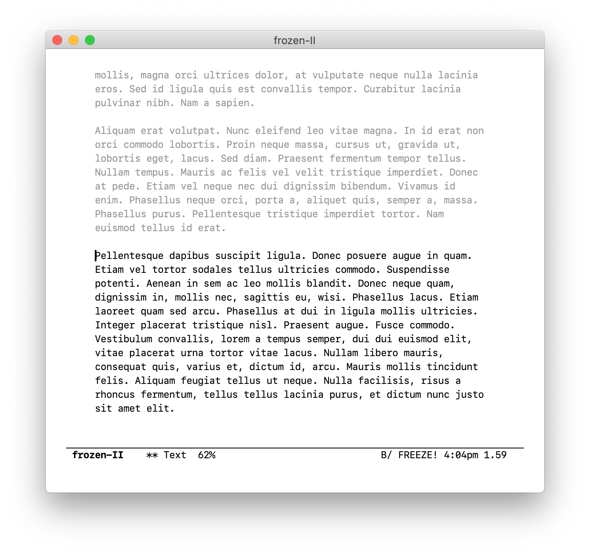

Freeze It
=========

[][1]
[][2]

An Emacs minor mode to kill your inner editor! Every writer struggles to
balance their creative and critical sides, with progress frequently
hindered by the temptation to go back and revise to get things *just
right*. Freeze It aims to combat this temptation.

After an idle delay `freeze-it-delay` all text between `point-min` and a
configurable distance before `point` will be made read-only.

Option `freeze-it-go-back` controls how far this distance "goes back"
before freezing text. This can be nil, `word`, `line`, `visible-line`,
`line`, or `paragraph`.

Command `freeze-it-show` will momentarily highlight read-only text in
the buffer while there is no user input. The highlighting uses
`freeze-it-show` face and displays for `freeze-it-show-delay` seconds.

Text remains read-only until you kill the buffer, so that you can't
cheat. This is by design, because the minor mode targets the
psychological *temptation* to revise your writing, rather than just the
ability.

Installation
------------

The latest stable release is available via [MELPA-stable][1]. First, add
MELPA-stable to your package archives:

    M-x customize-option RET package-archives RET

Insert an entry named `melpa-stable` with URL:
`https://stable.melpa.org/packages/`

You can then find the latest stable version of `freeze-it` in the list
returned by:

    M-x list-packages RET

If you prefer the latest but perhaps unstable version, do the above
using [MELPA][2].

Bugs and Feature Requests
-------------------------

Send me an email (address in the package header). For bugs, please
ensure you can reproduce with:

    $ emacs -Q -l freeze-it.el

Known issues are tracked with `FIXME` comments in the source.

[1]: https://stable.melpa.org/#/freeze-it
[2]: https://melpa.org/#/freeze-it
